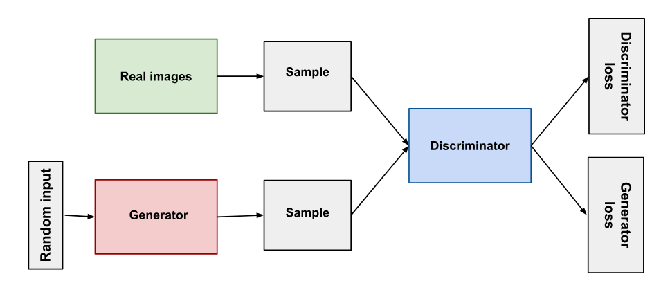
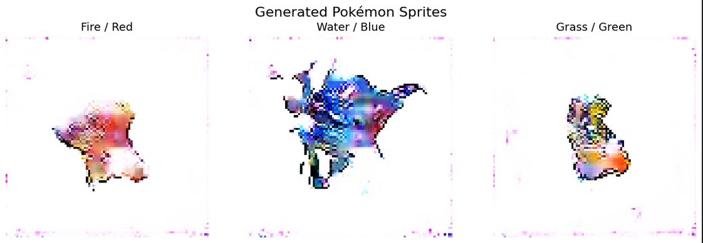
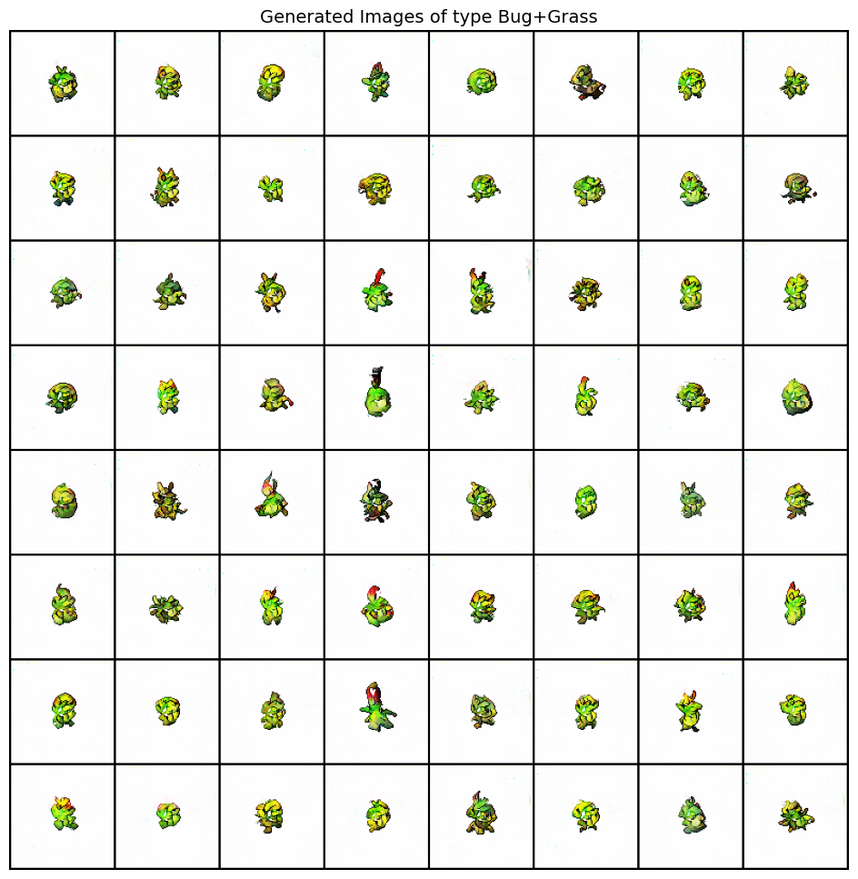

# PokemonGAN

En este repositorio se puede encontrar mi trabajo para la creación de un modelo GAN para la generación de sprites de Pokémon.

---

## 1. Selección del dataset

Para poder crear nuestro modelo necesitaríamos un dataset con ciertas restricciones, por ejemplo, que todas las imágenes base de Pokémon sigan el mismo estilo de sprite 2D y no modelos 3D como en generaciones más actuales.

Afortunadamente, en Kaggle encontré el dataset [Pokemon sprite images](https://www.kaggle.com/datasets/yehongjiang/pokemon-sprites-images), el cual contiene 10,437 imágenes en una resolución 96x96 de 898 Pokémon a lo largo de diferentes juegos.

---

## 2. Preprocesado de los datos

Aunque pudiera parecer que encontramos oro en este dataset, tenemos que revisarlo a fondo y tomar decisiones en base a lo que encontremos. Para empezar, casi la mitad de nuestras imágenes son de Pokémon shiny, los cuales son Pokémon con su paleta de colores alterada y esto no nos conviene para entrenar a nuestro modelo. Tomemos de ejemplo a Charizard, un Pokémon tipo fuego muy icónico y con una paleta de colores roja que claramente indica que es tipo fuego, pero su versión shiny cambia a una paleta oscura, la cual podría confundir a nuestro modelo que apenas está logrando reconocer que rojo == fuego, por lo que decidí eliminar las imágenes de Pokémon shiny.

El dataset también contiene imágenes de los Pokémon de frente y de espaldas. Esta decisión es un poco más arbitraria, pero decidí eliminar también las imágenes de espalda ya que quiero ver si el modelo logra aprender facciones faciales o alguna forma anatómica similar.

Para la normalización, las imágenes se transforman al rango [-1, 1] (media y desviación estándar de 0.5 por canal), consistente con la función `Tanh` a la salida del generador. Adicionalmente se aplica `RandomHorizontalFlip` como augmentación básica al cargar el dataset.

---

## 3. Implementación del modelo

Para la generación de imágenes decidí usar un modelo Generative Adversarial Network (GAN) multicondicional (tipo, color del Pokémon y si es legendario), el cual consiste en dos modelos: un generador que aprende a generar imágenes y un discriminador que aprende a distinguir entre los datos reales y los generados. En un entrenamiento ideal, el generador empieza produciendo imágenes claramente falsas y el discriminador fácilmente lo identifica, pero conforme sigue el entrenamiento el generador va mejorando a un punto donde el discriminador no logra discernir cuál imagen es real o generada.



Para apoyarme en la creación y comprensión de mi modelo, usaré el artículo [Taming the Tail in Class-Conditional GANs: Knowledge Sharing via Unconditional Training at Lower Resolutions](https://openaccess.thecvf.com/content/CVPR2024/papers/Khorram_Taming_the_Tail_in_Class-Conditional_GANs_Knowledge_Sharing_via_Unconditional_CVPR_2024_paper.pdf) en el que se analiza a fondo cómo las GANs tienden a perder diversidad y calidad en las muestras cuando el dataset tiene clases muy específicas o distribuciones desbalanceadas (llamadas *tail classes*, de ahí el nombre del artículo).

### Arquitectura del Generador

El generador recibe tres entradas separadas: un vector de ruido aleatorio de dimensión 100, y embeddings aprendidos para el tipo (`Embedding(NUM_TYPES, 32)`), el color (`Embedding(NUM_COLORS, 32)`) y si es legendario (`Dense(16)`). Las cuatro entradas se concatenan y se proyectan mediante una capa `Dense` a un feature map inicial de 3×3, que luego se va ampliando progresivamente:

```
ruido (100) + tipo_emb (32) + color_emb (32) + leg_emb (16)
        ↓ Dense → Reshape
   Feature map (512, 3, 3)
        ↓ UpSampling2D + Conv2D × 5
   Feature map (32, 96, 96)
        ↓ Conv2D + Tanh
   Imagen generada (3, 96, 96)
```

Cada bloque de upsampling usa `UpSampling2D` con interpolación nearest-neighbor seguido de una `Conv2D` con `BatchNorm` y `ReLU` para ir reduciendo los canales de 512 → 256 → 128 → 64 → 32 mientras dobla la resolución espacial en cada paso.

### Arquitectura del Discriminador

El discriminador recibe tanto la imagen (96×96) como las tres etiquetas de condicionamiento. Las etiquetas se procesan con los mismos embeddings que en el generador, se proyectan espacialmente mediante una `Dense` a un mapa de 96×96 y se concatenan como un canal adicional a la imagen antes de pasarla por las capas convolucionales:

```
imagen (96, 96, 3) + etiquetas proyectadas (96, 96, 1)
        ↓ Conv2D(64) → Conv2D(128) → Conv2D(256) → Conv2D(512)
   Feature map aplanado
        ↓ Dense(1) + Sigmoid
   Salida escalar (real/falso)
```

Todas las capas convolucionales del discriminador usan `LeakyReLU(0.2)` y `BatchNorm`. La salida es un único escalar que indica si la imagen es real o falsa; no hay cabeza auxiliar de clasificación de tipo.

### Función de pérdida e hiperparámetros

El modelo usa una única `BinaryCrossentropy` aplicada tanto al discriminador como al generador.

| Hiperparámetro | Valor |
|---|---|
| Dimensión del ruido | 100 |
| Batch size | 64 |
| Épocas | 50 |
| Optimizador | Adam (lr=0.0002, β₁=0.5) |

---

## 4. Evaluación inicial del modelo

Normalmente en un modelo de Deep Learning buscamos que la pérdida baje a cero, pero en una GAN si la pérdida de cualquiera de los dos modelos llega a cero significa que ha fracasado. Al ser un entrenamiento "adversarial" entre el generador y discriminador, `D_loss` y `G_loss` representan qué tan balanceada está la competencia entre ambos. Las métricas más directas para evaluar esto son `D(x)` y `D(G(z))`:

- **D(x)**: qué tan "real" clasifica el discriminador a las imágenes reales. En un entrenamiento balanceado debería acercarse a 0.7–0.8.
- **D(G(z))**: qué tan "real" clasifica el discriminador a las imágenes falsas. Si colapsa a 0, el generador dejó de recibir gradiente útil y el entrenamiento fracasó.

Al terminar de ejecutar el modelo obtenemos las siguientes métricas:

```
D_Loss: 0.0128 | G_Loss: 3.0363
```

Estos valores nos dejan ver que el discriminador se volvió extremadamente preciso, lo que implica que `D(x) → 1` y `D(G(z)) → 0`. Cuando esto ocurre el gradiente que le llega al generador se vuelve prácticamente cero y deja de aprender, lo que se conoce como **mode collapse**. Esto es exactamente el escenario de *tail classes* descrito en el paper: el discriminador aprendió a memorizar las clases frecuentes y el generador no tuvo forma de competir en las clases con pocos ejemplos.

Y ahora veamos la métrica más importante, la calidad de las imágenes generadas:



Como era de esperarse, los "pokemones" generados no son más que manchas de colores. El generador supo aprender que los sprites contienen un contorno negro y los colores genéricos de cada tipo de Pokémon, pero no hay nada con forma de piernas, brazos, cara o alguna forma anatómica de Pokémon.

---

## 5. Refinamiento del modelo

El colapso observado en el modelo inicial dejó claro que se necesitaban cambios fundamentales, no solo ajustes de hiperparámetros. Para el modelo refinado tomé como base el repositorio [PokeTypeGAN](https://github.com/ye-hongjiang/PokeTypeGAN) de ye-hongjiang, el cual implementa un AC-GAN con DiffAugment y Data2Data Cross-Entropy específicamente para la generación de sprites de Pokémon condicionada por tipo. A partir de esta base adapté el código para correr en Kaggle (migrando de TensorFlow a PyTorch) y ajusté los hiperparámetros.

### Cambios en el preprocesado

Se recuperaron las imágenes de espalda del dataset, que habían sido descartadas en la versión inicial. Mantenerlas duplica el tamaño efectivo del dataset y el modelo puede aprender a condicionarse en la orientación como una etiqueta adicional, resultando en aproximadamente 5,000 imágenes tras filtrar los shiny. Adicionalmente, se incorporó composición de canal alpha sobre fondo blanco para un procesamiento más limpio de los PNGs transparentes.

### Condicionamiento: embeddings separados -> vector binarizado

El modelo original condicionaba el generador y el discriminador pasando tres entradas separadas, tipo, color y si es legendario, cada una con su propio `Embedding` o capa `Dense`, e inyectando las etiquetas como un canal adicional proyectado espacialmente sobre la imagen.

El modelo refinado abandona las etiquetas de color y legendario, y en su lugar usa un único vector binarizado que codifica el tipo del Pokémon con `MultiLabelBinarizer`. Esto permite condicionamiento multi-etiqueta (un Pokémon puede ser tipo Fuego y tipo Volador simultáneamente), y el vector se concatena directamente con el ruido `z` en el espacio latente del generador, en lugar de inyectarse como canal adicional en la imagen.

### Arquitectura del Generador: `Dense + UpSampling` -> `ConvTranspose2d`

El generador refinado abandona la proyección `Dense` inicial y el `UpSampling2D` con interpolación nearest-neighbor, reemplazándolos por `ConvTranspose2d` que aprende los pesos del upsample directamente. Adicionalmente, cada bloque añade dos `Conv2d` extra para refinar los features antes del siguiente upsample, y reemplaza `ReLU` por `LeakyReLU(0.2)` en todas las capas intermedias para evitar el problema de *dying neurons*:

```
z + etiquetas (100 + n_labels, 1, 1)
        ↓ ConvTranspose2d
   Feature map (1024, 6, 6)
        ↓ Upsample block × 3  [ConvTranspose2d + Conv2d + Conv2d, cada uno con BatchNorm + LeakyReLU]
   Feature map (128, 48, 48)
        ↓ ConvTranspose2d + Tanh
   Imagen generada (3, 96, 96)
```

### Arquitectura del Discriminador: salida escalar -> AC-GAN con cabezas duales

El discriminador original recibía las etiquetas como input adicional y producía una única salida escalar, pero no tenía ningún mecanismo para verificar si las imágenes generadas correspondían al tipo solicitado.

El discriminador refinado tiene dos cabezas de salida separadas, convirtiéndolo en un **AC-GAN** (Auxiliary Classifier GAN): el generador ahora aprende no solo a engañar al discriminador sino también a generar imágenes que clasifique correctamente por tipo. Adicionalmente se aplica `SpectralNorm` en todas las capas convolucionales y `AdditiveGaussianNoise` con std que decae linealmente al inicio de cada bloque para regularizar y evitar memorización:

```
imagen (3, 96, 96)
        ↓ downsample_block × 4  [AdditiveGaussianNoise + SpectralNorm(Conv2d) + LeakyReLU]
   Feature map (512, 6, 6)
        ↙                    ↘
  adv_clf                 aux_clf
  (N, 1)               (N, n_labels)
 real/falso           tipo del Pokémon
```

### Función de pérdida: una `BCELoss` -> tres losses combinadas

El modelo original usaba una única `BinaryCrossentropy`. El modelo refinado combina tres:

**1. Pérdida adversarial** (`BCELoss`): mide qué tan bien distingue el discriminador entre imágenes reales y falsas.

**2. Pérdida auxiliar** (`BCELoss` ponderada por clase): mide qué tan bien predicen ambos modelos el tipo del Pokémon. Los pesos son inversamente proporcionales a la frecuencia de cada tipo en el dataset, compensando directamente el desbalance de clases que causó el colapso inicial.

**3. Pérdida contrastiva** (`Data2DataCrossEntropyLoss`): obliga al discriminador a aprender un espacio de embeddings donde imágenes del mismo tipo estén cerca entre sí y lejos de otros tipos. Esta loss está motivada directamente por el paper de referencia y ataca el problema de *tail classes* desde el espacio de representación.

```
Loss_total = Loss_adv + 0.25 × Loss_aux + 0.03 × Loss_clr
```

### Augmentación: ninguna -> DiffAugment

El modelo original no aplicaba ninguna augmentación durante el entrenamiento más allá del `RandomHorizontalFlip`. El modelo refinado aplica **Differentiable Augmentation (DiffAugment)** en cada iteración a todas las imágenes que ve el discriminador, tanto reales como falsas, con políticas de `color`, `translation` y `cutout`. Esto aumenta artificialmente la variedad de imágenes que ve el discriminador y evita que las memorice, una de las causas principales del colapso en datasets pequeños.

### Evaluación del modelo refinado
 
El entrenamiento del modelo refinado se mantuvo notablemente estable a lo largo de las 2,000 épocas, sin los colapsos ni las divergencias bruscas de pérdida que caracterizaron al modelo inicial. Esto es evidencia de que las mejoras introducidas, SpectralNorm, DiffAugment, la pérdida auxiliar ponderada y la pérdida contrastiva, cumplen su función de mantener la competencia entre generador y discriminador balanceada a largo plazo. El modelo probablemente podría seguir mejorando con más épocas de entrenamiento, pero por límites de tiempo de la entrega se detuvo en las 2,000.
 
La mejora más evidente se aprecia directamente en la calidad de las imágenes generadas:
 

 
A diferencia de las manchas de color del modelo anterior, el modelo refinado genera criaturas que ya tienen una forma reconocible: se pueden distinguir cuerpos, extremidades y rasgos que evocan claramente la estética de los sprites de Pokémon. El condicionamiento por tipo también funciona,  como se ve en la imagen de ejemplo para el tipo Bug+Grass, las criaturas generadas tienen consistentemente una paleta de verdes y amarillos apropiada para esos tipos.